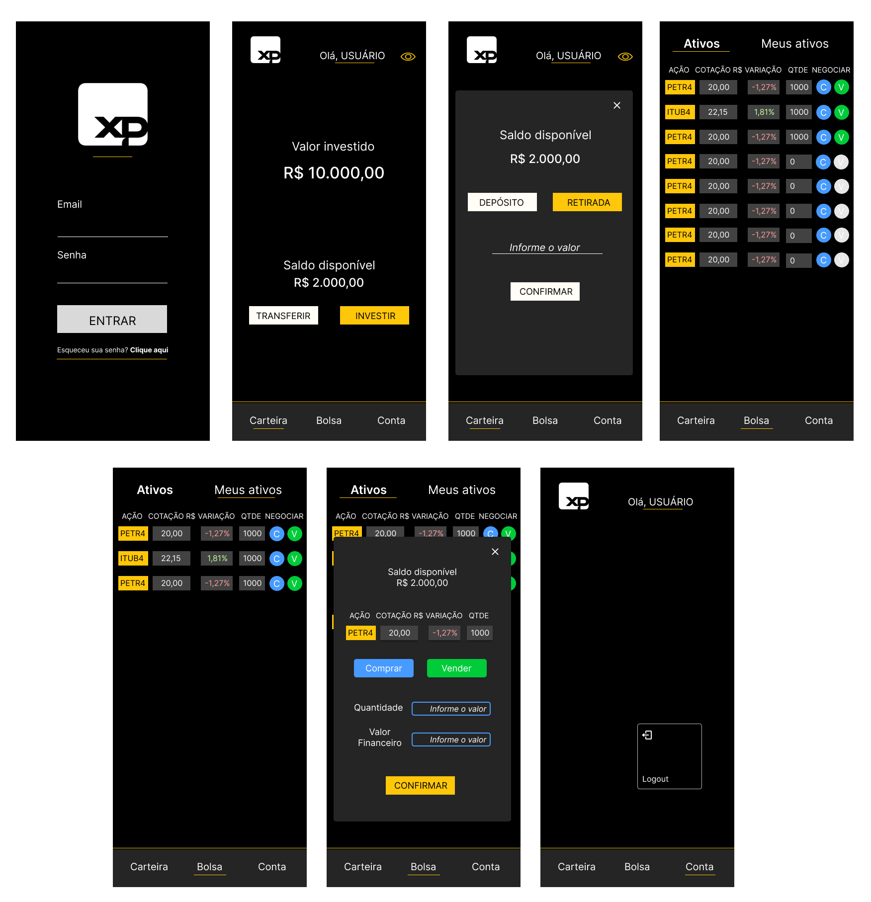

# Desafio Técnico XP

Projeto desenvolvido por Vinicius Pacheco Franco para o desafio técnico de Software Engineer I da XP.

## Objetivo

Desenvolver o Front-End/Mobile de um aplicativo de investimento em ações com algumas funcionalidades de conta digital.

## Como executar o Projeto? 

  
<strong>Com Docker</strong></sumary> 

  > Clone o repositório `git clone git@github.com:FrancoViniciusP/xp-challenge.git`.
  - Entre na pasta do projeto `cd xp-challenge`.

  > Crie uma imagem Docker com `docker build -t app-xp .`.
  - Não esqueça do ponto após "app-xp".
    
  > Crie um container a partir da imagem app-xp `docker run -dp 3000:3000 app-xp`.
    
  > Pronto! Agora acesse `http://localhost:3000/`.
  

 
<strong>Localmente</strong></sumary> 

  > Clone o repositório `git clone git@github.com:FrancoViniciusP/xp-challenge.git`.
  - Entre na pasta do projeto `cd xp-challenge`.
  
  > Instale as dependências `npm install`.
  
  > Inicie o projeto com `npm start`.

<strong>:iphone: Expeciência Mobile :iphone:</strong></sumary> 

> Esse aplicativo foi desenvolvido inicialmente para Mobile.
 - Para uma melhor experiencia aperte `F12` no browser.
 - E depois `Ctrl + Shift + M` para visualizar como mobile :smiley:.

## O que foi desenvolvido?

Um aplicativo para compra e venda de ações com foco na expêriencia mobile do usuário, utilizando:
 - JavaScript
 - React Hooks
 - Redux ToolKit
 - Styled Components
 - Jest

  
